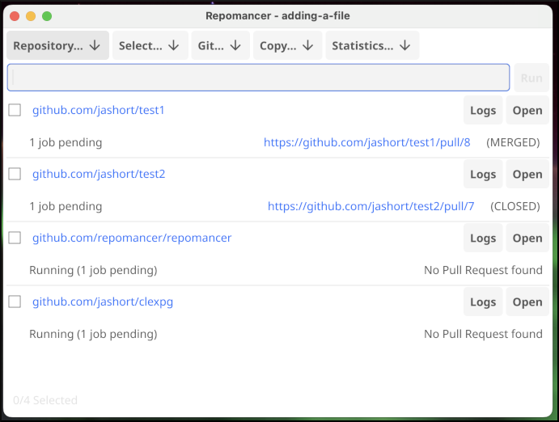

# Repomancer
A tool for bulk updating repositories




## Features

- Manage pull requests across multiple repositories
- Execute commands on some or all repositories
- Track open/merged pull requests and statistics

See the [walkthrough](docs/walkthrough.md) for example usage.

## Installation

**With HomeBrew**

1. Install Repomancer:
   ```shell
   brew tap repomancer/repomancer
   brew install --no-quarantine repomancer
    ```

2. Configure GitHub credentials:

   You **MUST** log in to each GitHub host, even if you normally use an SSH key [^1]. **Connect with HTTPS.**

    ```shell
   # Repeat for each GitHub host you want to use:
   gh auth login
    ```
3. Run Repomancer:
   ```shell
   # Launch from Launchpad, or:
   repomancer
    ```

[^1]: `gh` needs a personal access token to connect to the GitHub API, even if it uses the SSH key for cloning/pushing.
