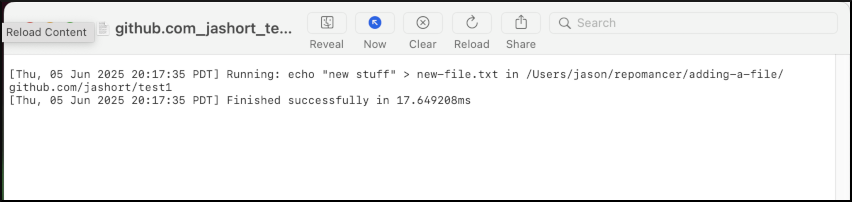

# Walkthrough

An example of using Repomancer to add a file to multiple repositories, commit changes, and open pull requests.

1. Start Repomancer

   

2. Click New Project. Give your project a name _(note: the project name will also be used as the branch name)_ and click Create

   

3. Click Repository > Add Multiple. Add the repositories you want to work on, one per line. Click Add.

   

4. Now each of these repositories has been cloned and we're ready to work.

   

5. Enter a command in the command bar and press return (or click run) to run it in each repository. _(The same command is run in the root directory of each repository)_

   

6. Click "Logs" to view output from all commands run in a repository

   

7. Click "Open" to view files in the repository

   

8. Commit changes - Click Git > Commit. Enter a commit message, then click Commit _(This is the same as running `git add . && git commit -m '<message>'`. Need more control? You can also run git commands in the command box!)_

   

9. Push changes: Click Git > Push

   

10. Open Pull Requests: Click Git > Pull Request. Enter a title and description, then click Create Pull Request.

    

    

11. Check Pull Request status: Click Git > Refresh Status

    

